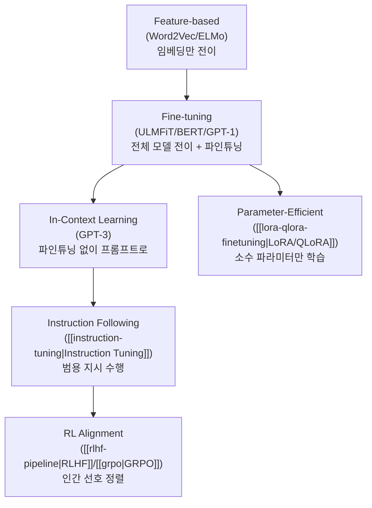

# NLP 전이 학습 (Transfer Learning for NLP)

## 개요

NLP 전이 학습은 대규모 비라벨 코퍼스에서 사전 학습(pretrain)한 언어 모델을 소규모 라벨 데이터로 파인튜닝(fine-tune)하여 하류 태스크에 적응시키는 패러다임이다. Howard & Ruder(2018)의 ULMFiT가 이 패러다임을 NLP에 체계적으로 도입했으며, 이후 GPT-1, BERT, T5, GPT-3으로 이어지는 발전 경로가 현대 LLM 생태계의 토대를 형성했다. 2026년 현재 "사전 학습 -> [[supervised-fine-tuning]] -> RL 정렬"이라는 3단계 파이프라인은 이 전이 학습 패러다임의 직접적 확장이다.

## 핵심 개념

### 전이 학습 이전: 처음부터 학습의 시대

전이 학습 이전의 NLP에서는 각 태스크마다 독립적인 모델을 처음부터 학습했다. Word2Vec, GloVe 등 사전 학습된 단어 임베딩을 사용하는 것이 유일한 전이 형태였으나, 문맥 독립적(context-free)이라는 한계가 있었다.

| 시기 | 접근 | 전이 범위 |
|------|------|-----------|
| ~2017 | Word2Vec/GloVe | 단어 임베딩만 전이, 나머지 처음부터 학습 |
| 2018 | ELMo | 문맥 임베딩 전이, 모델 구조는 태스크별 |
| 2018 | ULMFiT | 전체 언어 모델 전이 + 점진적 파인튜닝 |
| 2018-19 | GPT/BERT | Transformer 기반 대규모 전이 |
| 2020+ | GPT-3 | 파인튜닝 없는 in-context learning |

### ULMFiT: 체계적 전이 학습의 시작

ULMFiT(Universal Language Model Fine-tuning, Howard & Ruder, 2018)은 NLP에서 전이 학습을 효과적으로 만든 세 가지 핵심 기법을 도입했다.

**3단계 학습 과정:**

**핵심 기법:**

| 기법 | 설명 | 해결하는 문제 |
|------|------|--------------|
| 판별적 파인튜닝 (Discriminative Fine-tuning) | 레이어별로 다른 학습률 적용. 하위 레이어(일반 특징)는 낮은 학습률, 상위 레이어(태스크 특화)는 높은 학습률 | 하위 레이어의 일반 지식 보존 |
| 경사 삼각 학습률 (Slanted Triangular LR) | 초기에 빠르게 올리고 선형으로 감소하는 스케줄 | 빠른 수렴 + 안정적 학습 |
| 점진적 해동 (Gradual Unfreezing) | 최상위 레이어부터 순차적으로 학습 가능하게 해제 | 치명적 망각(catastrophic forgetting) 방지 |

**ULMFiT의 핵심 결과:**
- 대부분의 텍스트 분류 데이터셋에서 기존 최고 성능 대비 18-24% 오류율 감소
- 100개의 라벨 예제만으로 100배 많은 데이터로 처음부터 학습한 모델과 동등한 성능

### GPT: 생성적 사전 학습

GPT-1(Radford et al., 2018)은 ULMFiT의 패러다임을 Transformer decoder에 적용했다.

1. 대규모 코퍼스에서 [[causal-language-modeling]]으로 사전 학습
2. 태스크별 분류 헤드를 추가하여 파인튜닝

GPT-1의 핵심 기여는 Transformer의 자기회귀 사전 학습이 다양한 NLP 태스크에 효과적으로 전이된다는 것을 입증한 점이다.

### BERT: 양방향 전이 학습

BERT(Devlin et al., 2019)는 [[masked-language-modeling]]을 통해 양방향 문맥을 학습하는 encoder 기반 전이를 제안했다. 11개 NLP 벤치마크에서 당시 최고 성능을 기록하며, "사전 학습 + 파인튜닝" 패러다임을 NLP의 기본 접근으로 확립했다.

### GPT-3: Few-Shot과 In-Context Learning

GPT-3(Brown et al., 2020)는 별도의 파인튜닝 없이 프롬프트에 소수의 예시를 포함하는 것만으로 태스크를 수행하는 in-context learning을 보여주었다. 이는 전이 학습의 세 번째 패러다임 -- 파인튜닝 자체를 생략하는 방향 -- 을 열었다.

## 전이 학습 패러다임의 진화

2026년 현재 이 패러다임들은 상호 배타적이 아니라 결합되어 사용된다. 일반적인 프론티어 모델 개발 경로는 다음과 같다.

1. [[causal-language-modeling]] 사전 학습 (전이 학습의 1단계)
2. [[supervised-fine-tuning]] / [[instruction-tuning]] (전이 학습의 2단계)
3. [[rlhf-pipeline]] / [[grpo]] / [[rlvr]] (정렬 단계)
4. 사용자별 [[lora-qlora-finetuning]] (태스크 적응)

## 핵심 통찰

전이 학습이 NLP에서 성공한 근본적 이유는 언어의 구조적 규칙성에 있다. 문법, 의미론, 화용론의 패턴은 태스크에 관계없이 공유되며, 대규모 코퍼스에서 학습된 이 패턴들이 소규모 라벨 데이터로는 학습할 수 없는 풍부한 표현을 제공한다. [[superposition-neural-scaling]]는 이 전이의 효과가 모델 크기와 데이터 양에 따라 예측 가능하게 확대됨을 보여주었다.

## 대표 자료

- [Universal Language Model Fine-tuning for Text Classification (ULMFiT, Howard & Ruder, 2018)](https://arxiv.org/abs/1801.06146)
- [Improving Language Understanding by Generative Pre-Training (GPT-1, Radford et al., 2018)](https://cdn.openai.com/research-covers/language-unsupervised/language_understanding_paper.pdf)
- [BERT: Pre-training of Deep Bidirectional Transformers (Devlin et al., 2019)](https://arxiv.org/abs/1810.04805)

## 관련 문서

- [[causal-language-modeling]] -- 전이 학습의 핵심 사전 학습 방식 (GPT 계열)
- [[masked-language-modeling]] -- 전이 학습의 핵심 사전 학습 방식 (BERT 계열)
- [[supervised-fine-tuning]] -- 전이 학습의 파인튜닝 단계
- [[instruction-tuning]] -- zero-shot 일반화를 위한 파인튜닝 확장
- [[lora-qlora-finetuning]] -- 파라미터 효율적 전이 학습 기법
- [[superposition-neural-scaling]] -- 전이 학습 효과의 스케일링
- [[multi-task-learning]] -- 다중 태스크 학습과 전이 학습의 교차점
