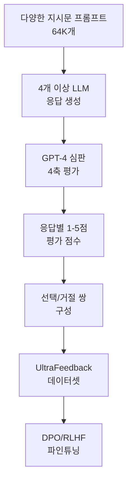
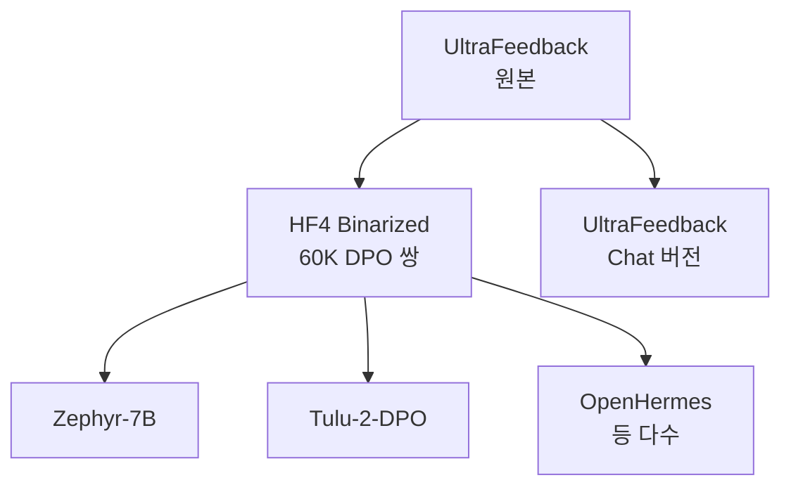

# UltraFeedback - 다중 모델 선호도 데이터셋

UltraFeedback은 GPT-4를 심판으로 활용하여 대규모 선호도 쌍을 자동 생성한 학습 데이터셋이다. 다수의 LLM 응답을 4가지 축으로 평가해 선택(chosen)/거절(rejected) 쌍을 구성함으로써 [[direct-preference-optimization]] 및 [[rlhf-and-alignment]] 학습의 핵심 재료로 활용된다.

## 개요



위 파이프라인은 UltraFeedback의 전체 데이터 생성 흐름을 보여준다. 프롬프트 하나에 대해 여러 모델의 응답을 GPT-4가 동시에 평가하여 순위를 매기는 구조다.

## 핵심 특성

### 규모
- **프롬프트**: 64,000개 이상의 다양한 지시문
- **총 응답 수**: 프롬프트당 4개 이상 모델 응답 수집
- **전체 선호도 쌍**: 약 1M+건 (binarized 버전 기준)

### 평가 4축 (Four Evaluation Axes)

| 축 | 설명 | 핵심 질문 |
|----|------|---------|
| 지시 따르기 (Instruction Following) | 프롬프트 요구사항 준수 여부 | 지시한 형식/조건을 지켰는가? |
| 도움성 (Helpfulness) | 실질적 도움 수준 | 문제를 실제로 해결하는가? |
| 정직성 (Honesty) | 사실 정확성과 불확실성 인정 | 거짓말하거나 과장하지 않는가? |
| 안전성 (Safety) | 해로운 내용 회피 | 유해한 출력을 생성하지 않는가? |

각 축은 1-5점 척도로 평가되며, 총합 또는 가중 합산으로 최종 순위를 결정한다.

## 데이터 수집 파이프라인

### 참여 모델 다양성
UltraFeedback은 단일 모델이 아닌 **다양한 크기와 계열의 LLM**에서 응답을 수집한다.

- GPT-4, GPT-3.5-Turbo (OpenAI 계열)
- LLaMA-2 시리즈 (70B, 13B, 7B)
- Falcon, Mistral, WizardLM, Alpaca 등

이처럼 다양한 모델의 응답을 비교함으로써 미세한 품질 차이를 학습할 수 있다.

### 프롬프트 소스
- ShareGPT, Evol-Instruct ([[evol-instruct-method]] 참조)
- FLAN 태스크, OpenOrca 질문 세트
- TruthfulQA (정직성 테스트)
- UltraChat (대화형 인스트럭션)

### Binarized UltraFeedback
원본 UltraFeedback에서 HuggingFace가 파생한 `UltraFeedback-binarized` 버전은 DPO 직접 학습에 최적화된 형태다.

- 최고 점수 응답 -> `chosen`
- 그 외 응답 중 하나 -> `rejected`
- 최종 60K+ 선호도 쌍

```python
from datasets import load_dataset

# HuggingFace Hub에서 로드
ds = load_dataset("HuggingFaceH4/ultrafeedback_binarized")

# 구조 확인
print(ds["train_prefs"][0].keys())
# dict_keys(['prompt', 'chosen', 'rejected', 'score_chosen', 'score_rejected'])
```

## Zephyr 파인튜닝 사례

UltraFeedback의 대표적 활용 사례는 HuggingFace H4의 **Zephyr-7B** 모델이다.


Zephyr-7B-Beta는 7B 파라미터 모델임에도 당시 LLaMA-2-70B를 여러 벤치마크에서 능가했다. UltraFeedback의 고품질 선호도 신호 덕분이다.

## UltraFeedback의 혁신성

### 기존 선호도 데이터와 비교

| 특성 | HH-RLHF | Anthropic Helpful | UltraFeedback |
|------|---------|-------------------|---------------|
| 규모 | 160K | 160K | 1M+ |
| 평가자 | 인간 | 인간 | GPT-4 (AI) |
| 평가 축 | 2개 | 2개 | 4개 |
| 생성 모델 다양성 | 낮음 | 낮음 | 높음 (10+) |
| 비용 | 높음 | 높음 | 낮음 |

### AI-as-Judge 패러다임
UltraFeedback은 **GPT-4를 심판으로 활용**하는 AI-as-Judge 패러다임의 선구자다. 이 접근법은:

- 인간 레이블러 대비 수십 배 빠른 데이터 생성
- 일관된 평가 기준 적용 가능
- 다축 평가로 세분화된 피드백 제공

단, GPT-4의 편향(자기 선호, 형식 선호 등)이 데이터에 반영될 위험이 있다.

## 파생 데이터셋 생태계

UltraFeedback을 기반으로 다양한 파생 데이터셋이 등장했다.



## 한계와 비판

1. **GPT-4 편향 전이**: GPT-4가 선호하는 스타일(긴 응답, 특정 형식)이 그대로 반영됨
2. **언어 편향**: 주로 영어 데이터로 구성, 다국어 품질 불균등
3. **안전성 평가 한계**: 미묘한 해악(은밀한 편향, 오보)은 평가 어려움
4. **시간 민감 정보**: 평가 시점 이후의 사실 변화 반영 불가

## 실무 활용 가이드

```python
from trl import DPOTrainer, DPOConfig
from datasets import load_dataset

# UltraFeedback binarized로 DPO 학습
dataset = load_dataset("HuggingFaceH4/ultrafeedback_binarized")

config = DPOConfig(
    beta=0.1,              # KL 정규화 강도
    max_length=2048,
    per_device_train_batch_size=4,
)

trainer = DPOTrainer(
    model=model,
    ref_model=ref_model,
    args=config,
    train_dataset=dataset["train_prefs"],
)
trainer.train()
```

## 관련 문서

- [[direct-preference-optimization]] - UltraFeedback으로 학습하는 핵심 알고리즘
- [[rlhf-and-alignment]] - 선호도 데이터 기반 정렬의 이론적 배경
- [[preference-data-collection]] - 선호도 데이터 수집 방법론 비교
- [[evol-instruct-method]] - UltraFeedback 프롬프트 소스 중 하나
- [[self-instruct-original]] - 합성 지시문 생성의 원조 방법론
- [[magpie-synthetic-instruction]] - 또 다른 대규모 합성 선호도 데이터 접근법
- [[supervised-fine-tuning]] - DPO 전 단계로 활용되는 SFT 학습
