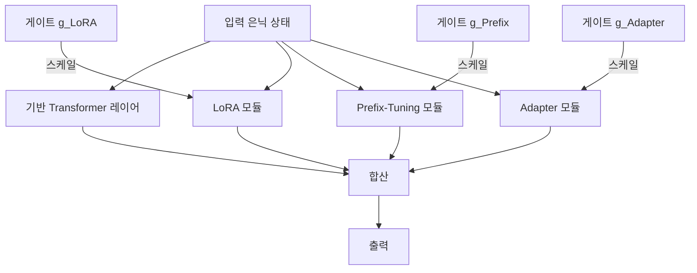

# UniPELT - 통합 파라미터 효율적 파인튜닝

## 배경과 문제 의식

파라미터 효율적 파인튜닝(PEFT, Parameter-Efficient Fine-Tuning) 방법론들은 저마다 서로 다른 태스크와 데이터 규모에서 장단점을 보인다. [[lora-qlora-finetuning|LoRA]]는 가중치 갱신에 강하고, [[prefix-tuning-deep-prompts|Prefix-Tuning]]은 생성 태스크에 유리하며, [[peft-adapter-survey|어댑터(Adapter)]]는 구조적 유연성이 높다. 그러나 어떤 방법이 특정 태스크에 최적인지 사전에 알기 어렵고, 단일 방법 고정 시 다른 상황에서 성능이 저하될 수 있다.

UniPELT(Unified Parameter-Efficient Language Model Tuning)는 이 문제를 해결하기 위해 **여러 PEFT 방법을 동시에 통합하고, 학습 가능한 게이팅(gating) 메커니즘으로 각 방법의 기여도를 동적으로 조절**하는 접근을 제안한다. 단일 방법보다 일관되게 우수한 성능을 달성하면서도 추가 파라미터 비용을 최소화한다.

## 핵심 구조

### 통합 구성 요소

UniPELT는 Transformer 레이어마다 세 가지 PEFT 모듈을 병렬로 배치한다:

| 구성 요소 | 적용 위치 | 역할 |
|-----------|-----------|------|
| LoRA | 어텐션 가중치 $W_Q$, $W_V$ | 가중치 행렬의 저랭크 갱신 |
| Prefix-Tuning | 어텐션 키-값 앞에 삽입 | 컨텍스트 제어를 위한 학습 가능 프리픽스 |
| Adapter | FFN 층 이후 | 병목 변환을 통한 태스크 적응 |

### 게이팅 메커니즘

각 PEFT 모듈에는 스칼라 게이트 $g \in [0, 1]$가 연결되며, 이 게이트 값이 해당 모듈의 활성화 여부와 기여 강도를 결정한다:

$$\text{출력} = \text{기반 레이어 출력} + g_{\text{LoRA}} \cdot \Delta W_{\text{LoRA}} + g_{\text{prefix}} \cdot \text{Prefix 기여} + g_{\text{adapter}} \cdot \text{Adapter 출력}$$

게이트는 시그모이드 활성화를 통해 연속 값으로 학습되며, 특정 모듈의 게이트가 0에 가까우면 해당 모듈은 사실상 비활성화된다. 이를 통해 모델이 각 태스크에 맞는 PEFT 조합을 **자동으로 발견**한다.



위 다이어그램은 단일 Transformer 레이어에서 세 PEFT 모듈이 병렬로 동작하고 게이트를 통해 통합되는 구조를 보여준다.

## 학습 절차

1. 기반 모델(pretrained LM)의 파라미터는 **동결(freeze)**.
2. LoRA 행렬, Prefix 벡터, Adapter 가중치, 게이트 파라미터를 학습.
3. 게이트는 역전파를 통해 손실 함수로부터 직접 업데이트되므로 별도 탐색 단계 불필요.
4. 학습이 완료되면 게이트 값을 분석해 어떤 PEFT 방법이 해당 태스크에 기여했는지 해석 가능.

## 파라미터 비용

UniPELT의 총 파라미터 수는 세 모듈의 합으로, 단순 합산보다는 적다. 실제 구현에서 LoRA 랭크를 4, Prefix 길이를 10, Adapter 병목 차원을 64로 설정하면 전체 모델 파라미터의 약 0.5-1% 수준이다. 단일 LoRA보다 파라미터가 더 많지만, 태스크 적응력 측면에서 보상이 충분하다.

## 실험 결과 및 우위

원논문에서는 GLUE 벤치마크 8개 태스크에 걸쳐 UniPELT를 LoRA, Prefix-Tuning, Adapter, 전체 파인튜닝과 비교했다:

- **평균 성능**: UniPELT가 개별 PEFT 방법 중 최고보다도 일관되게 높거나 동등.
- **분산 감소**: 태스크마다 최적 방법이 달라지는 불안정성이 크게 줄어듦.
- **소규모 데이터**: 학습 데이터가 적을 때 단일 방법 대비 특히 우수.
- **게이트 해석**: CoLA 같은 언어 수용성 태스크에서는 LoRA 게이트가 높게, 요약 태스크에서는 Prefix 게이트가 높게 학습되어, 게이트가 태스크 특성을 포착함을 확인.

## 실무 적용 관점

### 언제 UniPELT를 선택하는가

- 적용 태스크의 최적 PEFT 방법이 불확실할 때.
- 단일 모델로 여러 태스크를 처리해야 할 때 (멀티태스크 파인튜닝).
- 소규모 데이터셋에서 안정적인 성능이 필요할 때.
- PEFT 방법 비교 실험의 안정적 베이스라인이 필요할 때.

### 한계

- 세 모듈 동시 사용으로 단일 LoRA 대비 **추론 지연**이 약간 증가.
- 게이팅이 완전히 희소해지지 않으면 추론 시 모든 모듈을 활성화해야 함.
- PEFT 방법 조합이 세 가지로 고정되어 있어, 다른 조합(예: [[adalora-adaptive-rank|AdaLoRA]] + IA3)과의 통합은 별도 구현 필요.

### HuggingFace PEFT 라이브러리 통합

HuggingFace PEFT 라이브러리는 각 구성 요소를 독립적으로 지원하며, UniPELT 방식의 통합은 커스텀 래퍼로 구현할 수 있다. 실제 코드 스케치:

```python
from peft import LoraConfig, PrefixTuningConfig, AdapterConfig

# 각 PEFT 설정 정의
lora_config = LoraConfig(r=4, lora_alpha=16, target_modules=["q_proj", "v_proj"])
prefix_config = PrefixTuningConfig(num_virtual_tokens=10)

# 게이팅은 별도 모듈로 추가 구현 필요
# UniPELT 공식 구현: https://github.com/morningmoni/UniPELT
```

## 위치

[[peft-adapter-survey|PEFT 어댑터 방법론 개요]] → UniPELT → [[adalora-adaptive-rank|AdaLoRA 적응적 랭크 할당]] 순서로 PEFT 복잡도가 증가한다.

## 관련 문서

- [[lora-qlora-finetuning]] - LoRA/QLoRA 핵심 메커니즘
- [[prefix-tuning-deep-prompts]] - Prefix-Tuning 딥 프롬프트 방법론
- [[peft-adapter-survey]] - PEFT 어댑터 종합 개요
- [[adalora-adaptive-rank]] - 적응적 랭크 할당 LoRA
- [[ia3-injection-adapters]] - IA3 활성값 스케일링 어댑터
- [[fine-tuning-overview]] - 파인튜닝 방법론 전체 개요
- [[instruction-tuning]] - 지시 튜닝과 PEFT 결합
