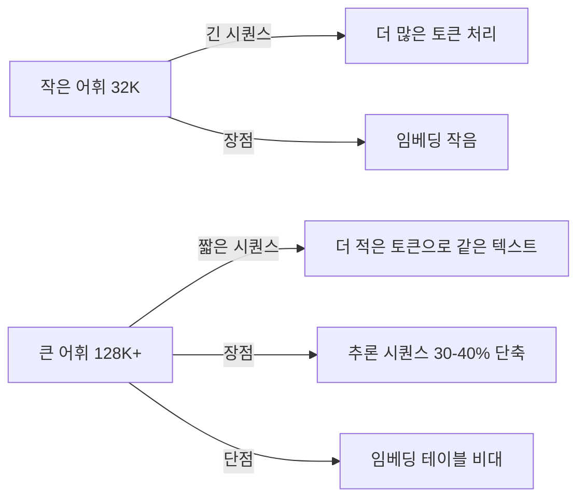

# 어휘 크기 스케일링

LLM 토크나이저의 어휘 크기가 32K에서 128K, 262K까지 확장되는 트렌드와 그 트레이드오프. 어휘를 키우면 시퀀스 길이가 줄어 효율이 높아지지만, 임베딩 레이어 비용이 증가한다.

## 어휘 크기 변천

| 모델 | 어휘 크기 | 이유 |
|------|----------|------|
| GPT-2 | 50,257 | 초기 BPE |
| Llama 2 | 32,000 | 보수적 선택 |
| **Llama 3** | **128,256** | 다국어 + 효율 |
| Gemini 3 | 262,144 | 극단적 압축 |
| Qwen 3 | 151,643 | 중국어 최적화 |

## 트레이드오프

- **시퀀스 단축**: 어휘 2x -> 시퀀스 ~15-20% 단축 -> 추론 비용 절감
- **임베딩 비용**: 어휘 128K x 차원 4096 = 0.5B 파라미터가 임베딩만으로
- **희귀 토큰**: 큰 어휘에서 저빈도 토큰의 임베딩 품질 저하
- **다국어**: 비라틴 언어(한국어, 중국어, 일본어)는 큰 어휘에서 압축 효율 크게 향상

## 관련 문서

- [[tokenization-bpe-sentencepiece]] -- BPE/SentencePiece
- [[chinchilla-scaling-laws]] -- Chinchilla 스케일링
- [[embedding-layers]] -- 임베딩 레이어
