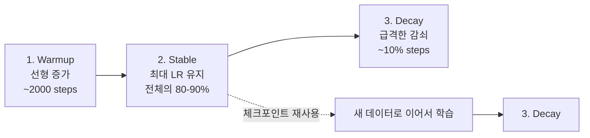

# Warmup-Stable-Decay (WSD) 스케줄러

3단계 학습률 스케줄: **워밍업 -> 안정(plateau) -> 짧은 감쇠**. 코사인 스케줄과 달리 안정 구간의 체크포인트를 재사용할 수 있어 **지속 사전학습(continual pretraining)**에 적합하다.

## 3단계 구조

## 코사인 스케줄과의 비교

| 측면 | 코사인 | WSD |
|------|--------|-----|
| 감쇠 형태 | 전체 구간 코사인 곡선 | 마지막 10%에서 급감쇠 |
| 체크포인트 재사용 | 어려움 (이미 감쇠 중) | 용이 (안정 구간) |
| 최종 성능 | 동등 | 동등 (감쇠 후) |
| 지속 학습 | 비적합 | **최적** |

## MiniCPM/Phi-3 적용

MiniCPM과 Phi-3은 WSD의 변형을 채택:
- 1차 일반 웹 데이터로 안정 구간까지 학습
- [[mid-training-phase|Mid-Training]]에서 고품질 데이터로 안정 구간 연장
- 최종 감쇠로 수렴

## 관련 문서

- [[learning-rate-scheduling]] -- 학습률 스케줄링 전체
- [[compute-optimal-training]] -- 연산 최적 학습
- [[domain-adaptive-continual-pretraining]] -- DACP
- [[mid-training-phase]] -- Mid-Training Phase
