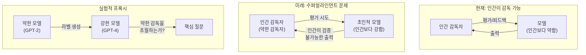
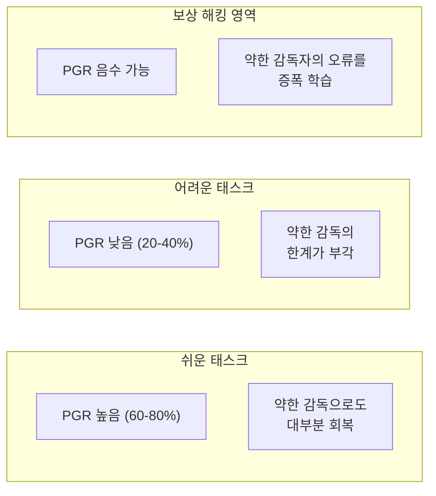

# Weak-to-Strong Generalization (약한-강한 일반화)

## 정의

**Weak-to-Strong Generalization(약한-강한 일반화)**은 Burns et al. (OpenAI, 2023)이 "Weak-to-Strong Generalization: Eliciting Strong Capabilities With Weak Supervision"에서 제시한 개념이다. 핵심 질문은 다음과 같다:

> "약한 모델(예: GPT-2)이 감독자(supervisor) 역할을 할 때, 강한 모델(예: GPT-4)이 감독자의 한계를 초월하여 일반화할 수 있는가?"

이 질문은 **수퍼얼라인먼트(superalignment)**의 핵심 도전 -- "인간보다 뛰어난 AI를 인간이 어떻게 정렬(align)할 것인가" -- 에 대한 실험적 프록시(proxy)다.

## 배경: 수퍼얼라인먼트 문제

현재의 AI 정렬 기법([[rlaif-scalable-oversight|RLHF, RLAIF]] 등)은 **인간이 모델의 출력을 평가할 수 있다**는 전제에 의존한다. 그러나 모델이 인간보다 뛰어난 영역에서는 이 전제가 성립하지 않는다.

위 다이어그램은 수퍼얼라인먼트 문제와 Weak-to-Strong 실험의 관계를 보여준다. 약한 모델로 강한 모델을 감독하는 실험은, 미래에 인간이 초인적 AI를 감독해야 하는 상황의 축소판이다.

Burns et al.의 통찰은, GPT-2(약한 모델)와 GPT-4(강한 모델)의 관계를 미래의 **인간(약한 감독자)과 초인적 AI(강한 모델)**의 관계에 대한 실험적 프록시로 사용할 수 있다는 것이다.

## 실험 설계

### 기본 구조

1. **약한 모델 학습**: GPT-2급 모델을 특정 태스크(NLP 분류, 체스 퍼즐 등)에서 파인튜닝하여 "약한 감독자"로 준비
2. **약한 라벨 생성**: 약한 모델이 학습 데이터에 대해 라벨을 생성 (이 라벨은 불완전하고 오류가 있음)
3. **강한 모델 학습**: GPT-4급 모델을 약한 모델이 생성한 라벨로 파인튜닝
4. **성능 측정**: 강한 모델이 약한 감독자의 정확도를 얼마나 초과하는지 측정

### Performance Gap Recovery (PGR)

Burns et al.은 성능 회복률을 정량화하기 위해 **PGR(Performance Gap Recovery)** 지표를 도입했다:

$$PGR = \frac{\text{strong (weak-supervised)} - \text{weak (ground truth)}}{\text{strong (ground truth)} - \text{weak (ground truth)}}$$

- PGR = 0%: 강한 모델이 약한 감독자 수준에 머뭄 (감독자 초월 실패)
- PGR = 100%: 강한 모델이 ground truth 학습 수준까지 완전히 회복 (완벽한 일반화)

## 핵심 실험 결과

### NLP 분류 태스크

| 태스크 | 약한 모델 정확도 | 강한 모델 (약한 감독) | 강한 모델 (GT 감독) | PGR |
|--------|-----------------|---------------------|--------------------|----|
| 감성 분석 | 78% | 87% | 95% | **53%** |
| NLI | 72% | 83% | 92% | **55%** |
| QA | 65% | 80% | 90% | **60%** |

핵심 발견:
- 약한 감독만으로도 강한 모델 성능의 **상당 부분을 회복** 가능 (PGR 50-60%)
- 강한 모델은 약한 라벨의 오류를 어느 정도 **자동으로 보정**함
- 그러나 ground truth 감독 대비 **완전한 회복에는 실패** (PGR < 100%)

### 태스크 난이도에 따른 차이

이 다이어그램은 태스크 난이도에 따른 PGR 변화 패턴을 보여준다. 쉬운 태스크에서는 강한 모델이 약한 감독을 효과적으로 보정하지만, 어려운 태스크에서는 한계가 분명해진다.

## 왜 약한 감독이 부분적으로 작동하는가

Burns et al.은 세 가지 가설을 제시했다:

### 1. 잠재 능력 활성화 (Capability Elicitation)

강한 모델은 사전학습 과정에서 이미 올바른 답을 "알고" 있으며, 약한 감독은 **이 잠재 능력을 활성화하는 신호** 역할을 한다. 약한 라벨이 완벽하지 않더라도, "대략적인 방향"만 제시하면 강한 모델이 자체 지식으로 나머지를 채운다.

### 2. 노이즈 필터링 (Noise Filtering)

강한 모델은 약한 라벨의 **체계적 오류 패턴을 감지**하고, 이를 필터링하여 원본 신호를 추출한다. 이는 노이즈가 있는 데이터에서 학습하는 것과 유사하며, 모델 크기가 클수록 노이즈 내성이 높다.

### 3. 표현 공간의 구조 (Representation Structure)

강한 모델의 내부 표현 공간은 약한 모델보다 풍부하므로, 약한 라벨에서 제한된 정보만 제공되어도 **강한 모델의 표현 공간에서 더 정확한 결정 경계**를 형성할 수 있다.

## 개선 기법

Burns et al.은 PGR을 높이기 위한 세 가지 기법을 실험했다:

### 1. Confidence-Based Filtering

약한 모델이 높은 확신도(confidence)를 보인 데이터만 선별하여 강한 모델을 학습시킨다. 약한 모델이 "확실히 안다"고 판단한 데이터는 오류율이 낮으므로, 학습 데이터의 품질이 향상된다.

### 2. Auxiliary Confidence Loss

강한 모델이 약한 라벨과 불일치할 때 "자신의 판단을 유지"할 수 있도록, 모델 자체의 확신도를 보조 손실(auxiliary loss)로 추가한다. 이를 통해 강한 모델이 약한 라벨에 과적합(overfit)하는 것을 방지한다.

### 3. Bootstrapping

반복적 프로세스: (1) 약한 감독으로 강한 모델을 학습 -> (2) 학습된 강한 모델이 새 라벨을 생성 -> (3) 이 라벨로 다시 학습. 각 반복에서 라벨 품질이 점진적으로 개선된다.

## 수퍼얼라인먼트에 대한 시사점

### 긍정적 신호

- 약한 감독만으로도 **상당한 성능 회복이 가능**하다는 것은, 미래에 인간이 초인적 AI를 감독할 때에도 "대략적인 방향 제시"가 유효할 수 있음을 시사
- 강한 모델이 약한 라벨의 오류를 스스로 보정하는 능력이 존재
- 감독 기법의 개선으로 PGR을 더 높일 여지가 있음

### 경고 신호

- PGR이 100%에 도달하지 못한다는 것은, **약한 감독의 근본적 한계**가 존재함을 의미
- 태스크가 어려워질수록 PGR이 하락하므로, 진정으로 초인적인 영역에서는 효과가 더 제한될 수 있음
- [[reward-hacking|보상 해킹]]과 유사하게, 강한 모델이 약한 감독자의 편향을 학습할 위험

### [[ai-safety-alignment-2026|안전성 정렬]] 연결

| 접근법 | 감독 방식 | Weak-to-Strong과의 관계 |
|--------|----------|----------------------|
| [[rlaif-scalable-oversight\|RLHF/RLAIF]] | 인간/AI 피드백 | 현재 표준. 인간 감독자 = 약한 감독자 |
| [[extended-constitutional-ai\|Constitutional AI]] | 원칙 기반 자기 감독 | 원칙 = 약한 신호, 모델이 자기 감독으로 일반화 |
| Debate | 모델 간 상호 검증 | 강한 모델끼리 감시하여 감독 품질 향상 |
| Scalable Oversight | 분해 + 재합성 | 어려운 문제를 약한 감독자가 평가 가능한 부분으로 분해 |

## OpenAI 수퍼얼라인먼트 팀과의 맥락

이 논문은 OpenAI 수퍼얼라인먼트 팀(Superalignment Team)의 첫 주요 발표였다. 해당 팀은 "4년 안에 초인적 AI를 정렬하는 문제를 해결하겠다"는 목표로 2023년 출범했으나, 2024년에 핵심 연구원(Ilya Sutskever, Jan Leike 등)이 이탈하면서 사실상 해체되었다. 그럼에도 Weak-to-Strong Generalization 프레임워크 자체는 수퍼얼라인먼트 연구의 표준 실험 패러다임으로 남아 있다.

## 실무 가이드라인

1. **모델 증류 시 참고**: 큰 모델(교사)이 작은 모델(학생)을 가르치는 일반적 증류와 방향이 반대이므로, 결과를 직접 적용할 때는 주의
2. **라벨 품질 평가**: 약한 모델이 생성한 합성 라벨의 품질이 전체 파이프라인 성능의 상한을 결정
3. **PGR 모니터링**: 새로운 태스크에서 Weak-to-Strong 접근을 시도할 때, PGR로 감독 효과를 정량화
4. **[[deliberative-alignment|숙의적 정렬]]과 결합**: 약한 감독 + 원칙 기반 자기 감독을 결합하여 PGR 개선 가능

## 관련 문서

- [[rlaif-scalable-oversight]] -- 확장 가능한 감독의 전체 맥락
- [[extended-constitutional-ai]] -- 원칙 기반 자기 감독으로 인간 감독 한계를 보완
- [[ai-safety-alignment-2026]] -- Weak-to-Strong이 속한 정렬 연구의 전체 맥락
- [[reward-hacking]] -- 약한 감독자의 편향을 악용하는 보상 해킹 위험
- [[deliberative-alignment]] -- 숙의적 정렬과의 결합 가능성
- [[automated-alignment-researchers]] -- Anthropic AAR 실험: PGR 0.97 달성 사례. 이 페이지에서 정의된 PGR 지표를 실전에 적용한 결과
