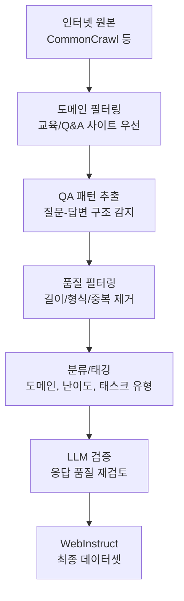

# WebInstruct - 웹 지시문 마이닝

WebInstruct는 인터넷의 자연 발생 질문-답변(QA) 쌍과 지시문을 대규모로 자동 수집하는 방법론이다. GPT-4로 합성 데이터를 생성하는 [[self-instruct-original]]이나 [[evol-instruct-method]]와 달리, **실제 인간이 인터넷에 남긴 질문과 답변을 원재료로 활용**한다.

## 핵심 전제

> 인터넷에는 이미 수억 개의 질문과 답변이 존재한다. 이를 체계적으로 수집·정제하면 고비용의 합성 데이터 생성 없이도 대규모 지시 학습 데이터를 확보할 수 있다.

## 웹 지시문 마이닝 파이프라인



## 수집 소스 유형

### 1. 전문 Q&A 플랫폼
- Stack Exchange (프로그래밍, 수학, 과학 등 180+ 커뮤니티)
- Quora (일반 질문)
- Reddit r/AskScience, r/ExplainLikeImFive 등

### 2. 교육 포럼
- 수학: Art of Problem Solving (AoPS), Math Stack Exchange
- 과학: PhysicsForums, ResearchGate
- 프로그래밍: Stack Overflow, GitHub Issues

### 3. 문서/매뉴얼 내 자연 발생 FAQ
- 공식 문서의 "자주 묻는 질문" 섹션
- 교과서의 연습문제-해설 쌍
- 학술 논문의 도전 과제 및 해결책 기술

## 합성 데이터 대비 장단점

| 특성 | WebInstruct (웹 마이닝) | 합성 데이터 (Self-Instruct 등) |
|------|----------------------|-------------------------------|
| 비용 | 낮음 (크롤링 + 필터링) | 높음 (GPT-4 API 호출) |
| 자연스러움 | 매우 높음 (인간이 작성) | 보통 (AI 특유의 패턴) |
| 도메인 커버리지 | 실제 인터넷 분포 따름 | 시드 데이터에 의존 |
| 품질 일관성 | 불균등 (원본 품질 편차) | 상대적으로 일관 |
| 스케일 | 수억~수십억 건 가능 | 수백만 건 (비용 제약) |
| 최신성 | 크롤링 시점 기준 | 생성 모델 지식 시점 기준 |

## MAmmoTH2에서의 활용

WebInstruct의 대표적 적용 사례는 **MAmmoTH2** (2024)다. Ohio State University 연구팀이 WebInstruct 파이프라인으로 1000만 개의 수학/과학 추론 데이터를 수집하여, GPT-4 합성 데이터 없이 강력한 추론 모델을 학습했다.


결과적으로 MAmmoTH2-8x7B는 수학 추론 벤치마크에서 GPT-4에 근접한 성능을 달성했다.

## 추출 기법: 자연 발생 지시문 인식

웹 텍스트에서 지시문-응답 쌍을 자동으로 추출하는 핵심 기법들:

### 구조적 패턴 매칭
- HTML 태그 기반: `<h2>Q:</h2>`, `<div class="answer">` 등
- 마크업 패턴: "**질문:** ... **답변:** ..."
- 번호 매기기: "1. 문제: ... 풀이: ..."

### LLM 기반 분류
```python
classifier_prompt = """
다음 텍스트가 질문-답변 쌍을 포함하는지 판단하세요.
포함한다면 질문과 답변을 추출하세요.

텍스트: {text}

출력 형식:
- 포함 여부: Yes/No
- 질문: (있다면)
- 답변: (있다면)
"""
```

### 품질 필터링 기준
1. 최소 답변 길이 (단순 "Yes/No" 제외)
2. 정보 밀도 (일반적인 문장 대비 QA 신호 비율)
3. 중복 제거 (MinHash 기반 퍼지 중복 검출)
4. 언어 식별 (목표 언어만 유지)

## 도전 과제

### 품질 불균등 문제
인터넷의 답변은 품질 편차가 크다. Stack Overflow의 상위 답변과 일반 포럼의 부정확한 답변이 섞인다. 해결책:

- 좋아요/상향투표 수 기반 가중치
- 전문 도메인(교육 사이트) 우선
- LLM 기반 품질 재평가

### 저작권 문제
웹 콘텐츠의 저작권은 복잡한 법적 문제를 야기한다. 학술 연구 목적의 공정 이용(fair use) 원칙 하에 수행되지만, 상업적 활용 시 주의가 필요하다.

### 오래된 정보
크롤링 시점 이후의 정보 변화를 반영하지 못한다. 특히 빠르게 변화하는 기술 도메인에서 한계가 있다.

## 실무 활용 전략

### 도메인 특화 웹 마이닝
특정 도메인의 전문 모델을 위한 데이터는 해당 도메인 포럼/사이트를 집중 크롤링한다.

```python
# 도메인별 크롤링 설정 예시
domain_configs = {
    "math": {
        "sources": ["artofproblemsolving.com", "math.stackexchange.com"],
        "qa_threshold": 0.8,
        "min_answer_length": 100
    },
    "coding": {
        "sources": ["stackoverflow.com", "github.com"],
        "qa_threshold": 0.7,
        "require_code_block": True
    }
}
```

### 합성 데이터와 병용
웹 마이닝 데이터는 광범위한 커버리지를 제공하고, 합성 데이터는 특정 능력(추론, 코딩 등)을 강화한다. 두 방법을 혼합하면 시너지가 난다.

## 관련 데이터셋 비교

| 데이터셋 | 방법 | 규모 | 도메인 |
|---------|------|------|--------|
| WebInstruct/MAmmoTH2 | 웹 마이닝 | 10M+ | 수학/과학 |
| [[self-instruct-original]] | 자기 생성 | 52K | 일반 |
| [[evol-instruct-method]] | 진화 생성 | 250K+ | 일반/코딩 |
| [[ultrafeedback-dataset]] | GPT-4 평가 | 1M+ | 일반 |
| [[magpie-synthetic-instruction]] | 자기 생성 | 4M | 일반 |

## 관련 문서

- [[self-instruct-original]] - 대표적 합성 지시문 생성 방법론
- [[evol-instruct-method]] - 진화 기반 합성 지시문 방법론
- [[magpie-synthetic-instruction]] - 정렬 모델 자기 생성 접근법
- [[synthetic-data-training]] - 합성 데이터 학습 전반
- [[instruction-tuning]] - 지시 학습의 기본 개념
- [[orca-progressive-learning]] - 교사 추론 모방 기반 학습
