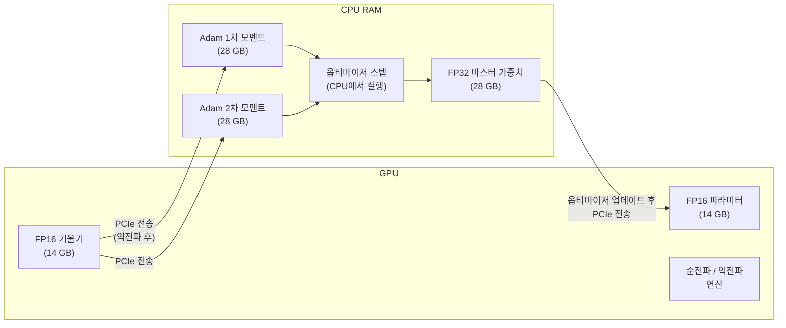
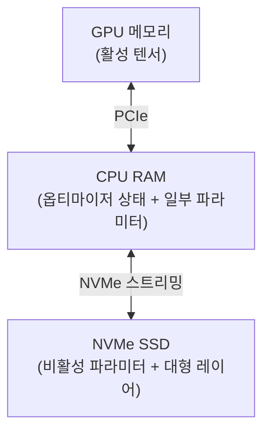

# ZeRO-Offload / CPU 오프로딩

## 개요

ZeRO-Offload는 Microsoft DeepSpeed 팀이 제안한 기법으로, GPU 메모리가 부족할 때 옵티마이저 상태와 기울기를 **CPU RAM으로 이동(offload)**하여 단일 GPU로 훨씬 큰 모델을 학습할 수 있게 한다. 2021년 논문 "ZeRO-Offload: Democratizing Billion-Scale Model Training"에서 발표되었으며, "V100 32GB 단일 GPU에서 70억 파라미터 모델 학습"을 핵심 주장으로 내세웠다.

[[data-parallelism-fsdp]]의 ZeRO(Zero Redundancy Optimizer) 패밀리의 한 구성원이지만, 분산 환경보다 **단일 GPU 환경**에 집중한다는 점이 독특하다.

## 메모리 분석: 왜 옵티마이저가 문제인가

LLM 훈련에서 GPU 메모리 사용처 분석:

| 구성 요소 | FP16 모델 | FP32 마스터 가중치 | Adam 1차 모멘트 | Adam 2차 모멘트 | 기울기 |
|---------|---------|--------|---------|---------|------|
| 크기 (파라미터당) | 2 bytes | 4 bytes | 4 bytes | 4 bytes | 2-4 bytes |
| 7B 파라미터 시 | 14 GB | 28 GB | 28 GB | 28 GB | 14-28 GB |

옵티마이저 상태(FP32 마스터 가중치 + Adam 두 모멘트)만 합쳐도 84 GB로, 7B 모델은 H100(80GB) 한 장에도 들어가지 않는다. ZeRO-Offload는 이 중 가장 많은 비중을 차지하는 **옵티마이저 상태를 CPU로 이동**한다.

## 오프로드 전략



핵심 흐름:
1. GPU에서 순전파, 역전파 수행 (FP16)
2. 기울기를 CPU로 전송
3. CPU에서 Adam 업데이트 수행 (FP32)
4. 업데이트된 파라미터를 GPU로 전송

## ZeRO-Infinity: NVMe 오프로드

ZeRO-Offload의 확장인 **ZeRO-Infinity**는 CPU RAM마저 부족할 때 NVMe SSD로 추가 오프로드한다:



NVMe 오프로드는 현대 NVMe SSD의 높은 순차 읽기/쓰기 속도(5-7 GB/s)를 활용한다. 이 덕분에 이론상 모델 크기에 하한이 없어지지만, 실제 훈련 속도(throughput)는 PCIe/NVMe 대역폭에 의해 제한된다.

## 성능 트레이드오프

오프로드는 메모리를 GPU에서 CPU/NVMe로 이전하는 대신, **PCIe 대역폭**이 새로운 병목이 된다:

| 연결 | 이론 대역폭 | 실제 유효 대역폭 |
|------|-----------|------------|
| PCIe 4.0 x16 (GPU-CPU) | 64 GB/s | 25-40 GB/s |
| NVMe (PCIe 4.0 x4) | 7 GB/s | 3-5 GB/s (순차) |
| NVLink (GPU-GPU) | 600 GB/s | 400+ GB/s |

오프로드가 많을수록 훈련 처리량(iteration/sec)이 감소한다. ZeRO-Offload의 실험에서 단일 GPU의 경우 ZeRO-2 대비 약 40-50% 처리량 하락이 보고되었다.

## FSDP CPU Offload

[[data-parallelism-fsdp]](PyTorch FSDP)도 CPU 오프로드를 지원한다. `CPUOffload(offload_params=True)` 설정으로 활성화하며, 원리는 ZeRO-Offload와 유사하다. 차이점:

- **DeepSpeed ZeRO-Offload**: 단일 GPU 지원, NVMe까지 확장 가능
- **FSDP CPUOffload**: 다중 GPU 분산 환경에서의 오프로드에 더 최적화

## GaLore와의 비교

[[galore-gradient-low-rank]] 페이지에서 다루듯, GaLore는 옵티마이저 상태 자체의 크기를 줄이는 반면, ZeRO-Offload는 크기를 줄이지 않고 저장 위치를 이동한다. 두 기법은 독립적으로 결합 가능하다: 저랭크 옵티마이저 상태를 CPU에 오프로드하면 메모리 절약이 극대화된다.

## 실용적 사용 지침

- **단일 GPU, 큰 모델**: ZeRO-Offload가 핵심 도구. 7B-13B 모델을 24-40GB GPU에서 학습 가능
- **CPU RAM 충분히 확보**: 옵티마이저 상태를 수용할 CPU RAM 필요 (128 GB+ 권장)
- **배치 크기 조정**: 오프로드로 GPU 메모리가 확보되면 배치 크기를 늘려 처리량 만회
- **gradient checkpointing 병행**: ZeRO-Offload만으로 부족하면 activation checkpointing도 활성화

```python
# DeepSpeed ZeRO-Offload 설정 예시 (ds_config.json)
{
  "zero_optimization": {
    "stage": 2,
    "offload_optimizer": {
      "device": "cpu",
      "pin_memory": true
    },
    "allgather_partitions": true,
    "reduce_scatter": true
  }
}
```

## 관련 문서
- [[deepspeed-internals]] -- DeepSpeed 내부 구조

- [[data-parallelism-fsdp]] -- ZeRO/FSDP 기반 분산 데이터 병렬화 (ZeRO-Offload의 상위 프레임워크)
- [[distributed-training-overview]] -- 분산 학습 전반 개요
- [[galore-gradient-low-rank]] -- 옵티마이저 상태 크기 자체를 줄이는 보완 기법
- [[gradient-accumulation-checkpointing]] -- GPU 메모리 절약을 위한 추가 기법
